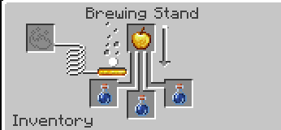

# Damage Slot Disabler

Un mod para Minecraft 1.20.1 (Fabric) que añade un desafío único de supervivencia: cada vez que recibes daño de cualquier tipo, se bloquea de forma indefinida un slot de tu inventario.

## Características Principales

- **Penalización por Daño**: Al recibir un golpe, se bloquea un espacio de tu inventario. Si tenías un ítem en ese slot, este caerá al suelo automáticamente. No puedes recoger ítems del suelo si tu inventario solo tiene slots bloqueados.
- **Orden Estratégico de Bloqueo**: 
  1. Primero se bloqueará la mano secundaria (Off-hand).
  2. Luego se irá bloqueando el inventario principal (De arriba hacia abajo, izquierda a derecha).
  3. Por último, tu barra de acceso rápido o Hotbar empezará a bloquearse desde el extremo derecho hacia la izquierda.
- **Persistencia Post-Mortem**: La muerte no reinicia tu progreso negativo. ¡Los slots bloqueados permanecen bloqueados incluso después de reaparecer!
- **Configuración Personalizable**: Puedes configurar el mod editando el archivo `config/damageslotdisabler.json` para limitar la cantidad máxima de slots que pueden bloquearse o decidir si los ítems caen o no al momento del bloqueo.
- **Comando para Administradores**: Se puede usar el comando `/unlockslots` en el chat (requiere nivel de operador/trucos) para reiniciar instantáneamente todos los slots del jugador.

## Mecánica de Recuperación: Poción Desvinculadora (Unbind Potion)

Dado que este mod impone una curva de dificultad muy arriesgada, la única manera legítima de recuperar tus espacios es elaborando y bebiendo la nueva **Unbind Potion** (Poción Desvinculadora). 

Al beber esta poción recuperarás de inmediato 1 slot bloqueado de tu inventario.

### Elaboración
Para fabricar la poción, utiliza un **Soporte para Pociones**. Coloca una **Manzana Dorada** como ingrediente en la parte superior y usa **Botellas de Agua** (Water Bottles) en los espacios inferiores.

---
**Desarrollo:**
Mod desarrollado para Fabric 1.20.1.
